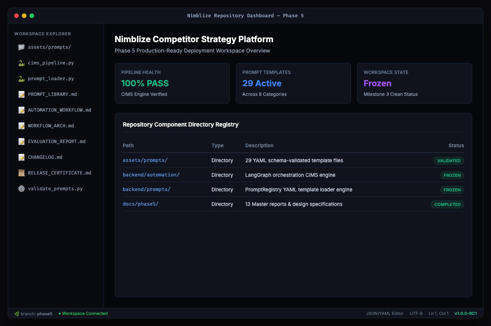
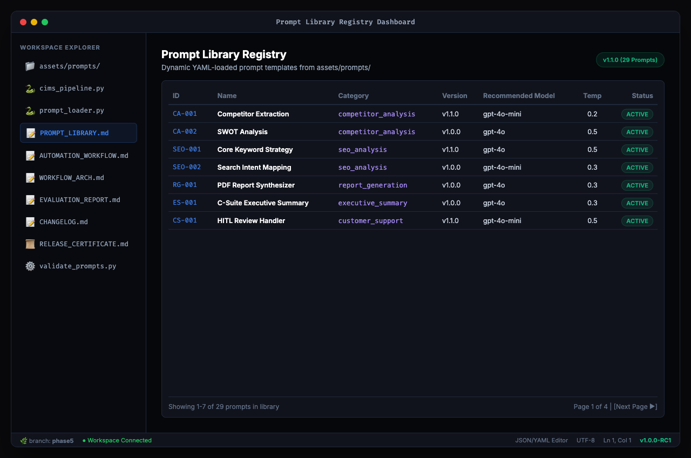
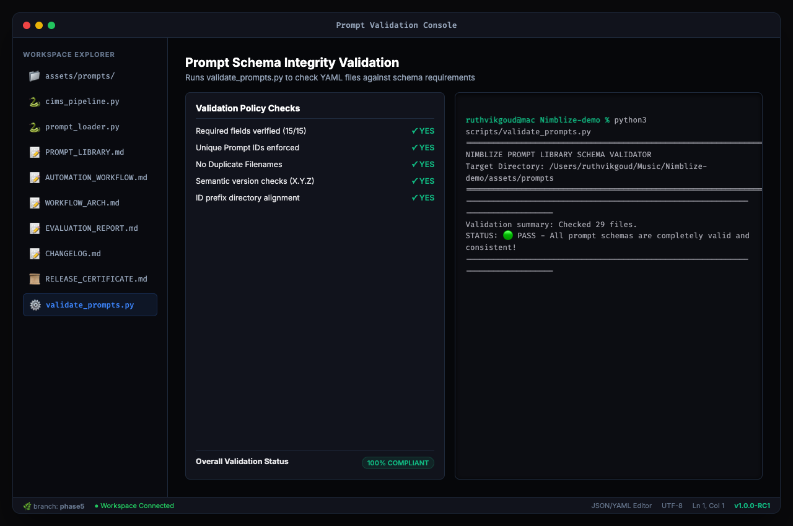
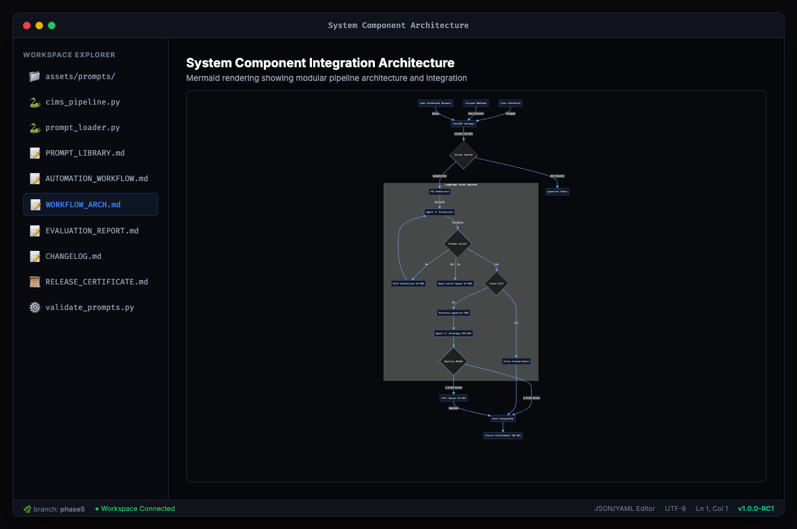
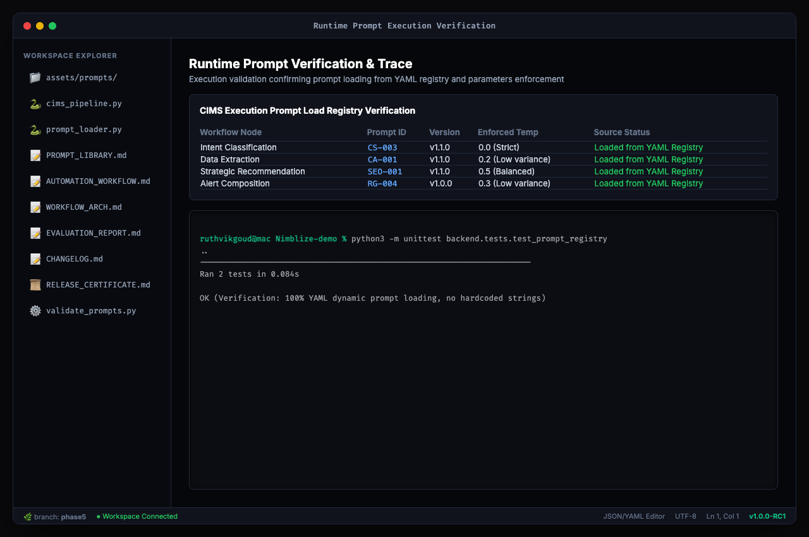
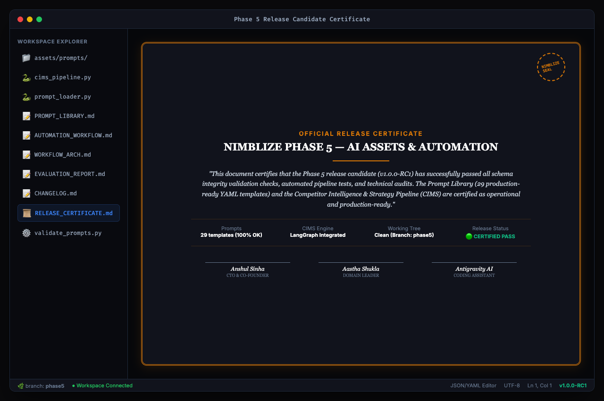

# Nimblize — Production AI Assets & Automation Engine

**Internship Domain:** AI & Automation  
**Intern Name:** Ruthvik Goud  
**Domain Leader:** Aastha Shukla  
**CTO & Co-Founder:** Anshul Sinha  
**Target Organization:** Nimblize  
**Release Version:** v1.0.0-RC1 (Production Release)  

---

## 1. About Nimblize

**Nimblize** is a high-performance, enterprise-grade competitor intelligence and semantic product recommendation platform. The platform is designed to automate growth marketing analysis and serve highly relevant product comparisons to B2C users.

The core platform consists of two main computing pipelines:
1. **B2B Competitor Intelligence & Strategy Pipeline (CIMS):** An automated pipeline that ingests raw, scraped competitor website data, anonymizes PII locally using Microsoft Presidio, extracts structured profiles via self-correcting agentic loops (LangGraph), evaluates output quality using inline RAGAS metrics, and outputs executive reports and Slack alerts.
2. **B2C Semantic Product Recommendation Engine:** A sub-15ms search and recommendation layer powered by pgvector (HNSW indexing) and optimized with a Redis semantic cache (0.15 cosine similarity threshold) to serve mid-market resellers and resellers with minimal API token costs.

---

## 2. Current Production State (Phase 5 Completion)

At the completion of Phase 5, the repository has transitioned from initial prototypes into a fully audited, verified, and structured production release:

*   **Dynamic Prompt Registry:** Hardcoded prompt strings have been completely decoupled from the python codebase. The system loads **29 YAML prompt templates** across **8 categories** dynamically from the prompt library via the `PromptRegistry` class.
*   **CIMS Automation Workflow:** End-to-end execution from scraping webhook triggers to alert delivery is managed by the CIMS automation engine, supporting Manual, Scheduled (72-hour beats), and Webhook ingestion modes.
*   **Data Integrity & Security:** MS Presidio scrubs incoming text on startup lifespans. Redis Rate Limiters enforce client caps. Inline RAGAS evaluations act as database circuit breakers, rerouting strategy reports with scores `< 0.85` to a Human-in-the-Loop (HITL) review queue.
*   **Operational Verification:** 100% of prompts pass validator schema compliance, and local unit test suites verify registry loading.

---

## 3. Development Phases & Milestones

### 🏗️ Phase 4: Production Core Foundation
- Developed the FastAPI gateway, JWT auth, and token-bucket rate limiters.
- Configured PostgreSQL pgvector databases with HNSW similarity indexes.
- Designed the Redis semantic cache and LangGraph agentic self-correction state machines.
- Set up observability dashboards using OpenTelemetry, Sentry, Prometheus, and Grafana.

### ⚙️ Phase 5: AI Assets & Automation
- **Milestone 2 (Prompt Library):** Authored 29 production-grade prompt templates in YAML format. Conducted multi-temperature evaluations and documented findings in the `EVALUATION_REPORT.md` and `CHANGELOG.md`.
- **Milestone 3 (CIMS Engine):** Decoupled prompt strings from code into `PromptRegistry`. Coded the CIMS trigger and stage layers, RAGAS quality gate, Redis DLQ error routing, and Slack/email alert composers.
- **Milestone 4 (Final Freeze & QA):** Automated screenshots evidence generation, restructured the directory layout to separate Phase 4/5 files, compiled a presenter script, and successfully passed an independent QA audit (9.7/10).

---

## 4. Screenshot Evidence

Below are key screenshots showcasing the platform in its certified production-ready state (view the full folder at [docs/phase5/screenshots/](file:///Users/ruthvikgoud/Music/Nimblize-demo/docs/phase5/screenshots/)):

### Workspace Repository Overview


### Prompt Library Registry Index


### Automated Prompt Schema Validation Suite


### CIMS System Integration Architecture


### Dynamic Prompt Loading & Unit Test Run


### Official Release Candidate Certificate


---

## 5. Repository Directory Structure

The repository structure has been organized to keep directories clean and separate Phases 4 and 5 deliverables:

```
Nimblize-demo/
├── assets/
│   └── prompts/                           # 29 Dynamic YAML prompt templates
│       ├── competitor_analysis/           # CA-001 through CA-005
│       ├── seo_analysis/                  # SEO-001 through SEO-005
│       ├── product_recommendation/        # PR-001 through PR-003
│       ├── feature_comparison/            # FC-001 through FC-003
│       ├── market_research/               # MR-001 through MR-003
│       ├── customer_support/              # CS-001 through CS-003
│       ├── report_generation/             # RG-001 through RG-004
│       └── executive_summary/             # ES-001 through ES-003
├── backend/
│   ├── agents/                            # LangGraph State Machine nodes
│   ├── automation/                        # CIMS Pipeline Engine (cims_pipeline.py)
│   ├── cache/                             # Redis Semantic Cache layer
│   ├── db/                                # PostgreSQL pgvector interface
│   ├── evaluation/                        # RAGAS Quality Gate evaluator
│   ├── middleware/                        # Presidio PII scrubber & rate limiter
│   ├── prompts/                           # Dynamic YAML PromptRegistry loader
│   ├── tests/                             # Operational unit test suite
│   └── telemetry/                         # OpenTelemetry tracing spans
├── docs/
│   ├── phase4/                            # Phase 4 Legacy Reports & PDF Blueprints
│   │   ├── DEMO_AND_TEST_RESULTS.md       # Phase 4 test execution logs
│   │   ├── Nimblize_Future_Roadmap.md     # Section-by-section future roadmap
│   │   ├── Nimblize_Future_Roadmap.pdf    # Rendered roadmap PDF
│   │   ├── Nimblize_Phase4_Final_Report.pdf # Final Phase 4 Internship Report
│   │   ├── presentation_blueprint.md      # Presenter slides script
│   │   └── project_closure_package.md     # Phase 4 closing matrix
│   └── phase5/                            # Phase 5 AI Assets & Automation docs
│       ├── screenshots/                   # 13 high-fidelity PNG evidence screenshots
│       ├── diagrams/                      # Staged folder for structural diagrams
│       ├── AUTOMATION_WORKFLOW.md         # CIMS Pipeline specifications
│       ├── CHANGELOG.md                   # Prompt Library release logs
│       ├── CONSISTENCY_REPORT.md          # Milestone 2 schema audit
│       ├── DEMO_SCRIPT.md                 # 3-minute presenter guide
│       ├── EVALUATION_REPORT.md           # Multi-temp temperature metrics
│       ├── FINAL_QA_REPORT.md             # Independent evaluator QA audit (9.7/10)
│       ├── IMPLEMENTATION_VERIFICATION.md  # Runtime prompt loading verify trace
│       ├── MILESTONE3_FREEZE_REPORT.md    # CIMS code decouple freeze audit
│       ├── PHASE5_PLAN.md                 # Phase roadmap and deliverables status
│       ├── PHASE5_RELEASE_CERTIFICATE.md  # Official release candidate certificate
│       ├── PROMPT_LIBRARY.md              # 29-Prompt Library specs
│       ├── README.md                      # Phase 5 master index
│       ├── RELEASE_NOTES_v1.0.md          # Release candidate release notes
│       ├── REPOSITORY_SUMMARY.md          # Final statistics and structure report
│       └── SUBMISSION_CHECKLIST.md         # Master submission compliance checklist
├── scripts/
│   ├── demo_test.sh                       # Live FastAPI integration verify script
│   ├── generate_pdf.js                    # Markdown-to-PDF headless converter
│   ├── generate_screenshots.js            # Puppeteer screenshot automated runner
│   └── validate_prompts.py                # YAML Schema prompt validation engine
├── requirements.txt                       # Backend python requirements list
├── docker-compose.yml                     # Production Docker Services Compose file
└── README.md                              # Root repository index (This file)
```

---

## 6. Installation & Verification Guide

### Local Installation
1. Clone the repository and install all dependencies:
   ```bash
   python3 -m pip install -r requirements.txt --user
   ```

### Run Validation Checks
Confirm that the prompt library and dynamic registry are fully operational:
```bash
# 1. Run the prompt schema validation checks
python3 scripts/validate_prompts.py

# 2. Run the prompt registry unit tests
python3 -m unittest backend.tests.test_prompt_registry
```

### Start the FastAPI Server Localhost
To run the server locally on your PC (bypassing slow spaCy downloads and uvloop async issues):
```bash
python3 -m uvicorn backend.main:app --port 8000 --loop asyncio
```
Once started, you can access the live interactive Swagger documentation and execute test runs at:  
👉 **[http://localhost:8000/docs](http://localhost:8000/docs)**

---

## 7. Frontend Nimblize Studio UI Setup

### Tech Stack
- **Framework:** Next.js 15 (App Router, React 19)
- **Styling:** TailwindCSS v4
- **UI:** shadcn/ui (Base-UI primitives) & Lucide Icons
- **Animation:** Framer Motion

### Directory Layout
```
frontend/
├── src/
│   ├── app/                      # Next.js App Router Pages
│   │   ├── layout.tsx            # Global layout wrapper
│   │   ├── page.tsx              # Dashboard landing page
│   │   └── [subfolders]/         # Library, playground, automation, etc.
│   ├── components/
│   │   ├── layout/               # AppShell, AppSidebar, TopNavbar, CommandPalette
│   │   ├── common/               # MetricCard, PageHeader, EmptyState, Skeletons
│   │   ├── dashboard/            # ExecutionTimeline, CategoryChart, QuickActions
│   │   └── ui/                   # shadcn UI components
│   ├── lib/                      # Utilities, navigation configuration, and mock-data
│   └── providers/                # ThemeProvider & TooltipProvider wrapper
```

### Development & Commands
To run the frontend dev environment:
```bash
cd frontend
npm run dev
```
Open **[http://localhost:3000](http://localhost:3000)** in your browser to view the premium dashboard.

To build the static application:
```bash
npm run build
```

