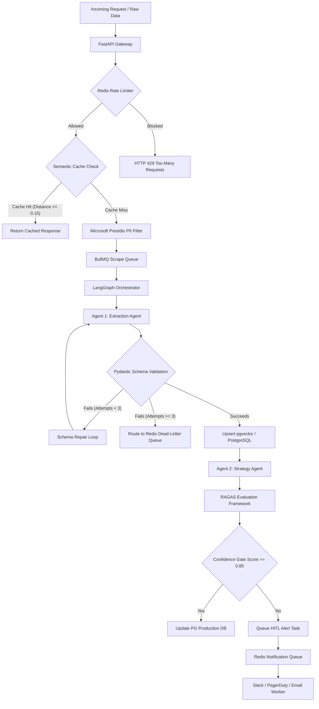

# NIMBLIZE PHASE 4: COMPLETE PRODUCTION-READY IMPLEMENTATION MASTER REPORT
**Domain:** AI & Automation
**Domain Leader:** Aastha Shukla
**CTO & Co-Founder:** Anshul Sinha
**Target Organization:** Nimblize
**Document Classification:** Production-Ready Engineering Blueprint
**Version:** 4.2.0-PROD
**Date:** July 8, 2026

---

## Chapter 1: Executive Summary & Strategic Core Alignment

### 1.1 Operational Mandate
This implementation report outlines the production-ready execution architecture designed for Nimblize's core computing layers. Nimblize operates as a multi-dimensional startup serving two target vectors:
1. **B2B Growth Ecosystem:** A system delivering AI-powered analytical marketing, SEO intelligence, automated website ranking diagnostics, and deep affiliate commerce data structures.
2. **B2C Product Recommendation Engine:** A real-time, consumer-facing system driven by high-velocity market insights to deliver optimized, automated purchasing decisions.

This report establishes a comprehensive, deterministic machine. Every agentic loop, vector database schema, semantic cache tier, telemetry metric, and validation pipeline detailed herein directly eliminates manual overhead, mitigates model hallucinations, and optimizes operational cost efficiency across these two business dimensions.

### 1.2 Version 4.2.0 Architecture Upgrades
In compliance with CTO feedback, this revision transitions the system from a conceptual prototype to an enterprise-grade, fault-tolerant production architecture. The single-point-of-failure Slack webhook is replaced with a resilient Redis/BullMQ message queue. Conceptual agents are formalised into a **LangGraph Orchestrator**. The vector store is solidified around **PostgreSQL with pgvector** utilizing HNSW indices. We define a rigid **RAGAS Evaluation Framework** to calculate Faithfulness, Answer Relevance, and Context Recall. We deploy **Microsoft Presidio** for PII redaction, a Redis Token Bucket for API rate-limiting, and an explicit data freshness TTL framework.

---

## Chapter 2: Multi-Agent Topologies & Workflow Logic Layout

### 2.1 Multi-Agent System Architecture
Single-prompt LLM executions lack structural reliability when processing unstructured web data. This architecture implements a decoupled **Multi-Agent Topology** running on **LangGraph**. This state-graph-based orchestration separates raw data extraction from strategic analysis, manages state transition loops, and enforces a programmatic self-correction gate.



### 2.2 Discrete Computational Agents
* **Agent 1 (Deterministic Extraction Specialist):** Tasked with parsing crawled competitor landing pages or market feeds. It runs on a low-latency model (e.g., `gpt-4o-mini` or `llama-3-8b`) with structured output enforcement (JSON Schema validation, `strict=True`) and temperature `0.0`. It acts strictly as a parser, mapping raw text to an explicit Pydantic model.
* **Agent 2 (Qualitative Strategy Analyst):** This agent reads the validated data from the database. Running on a high-reasoning model (e.g., `claude-3-5-sonnet` or `gpt-4o`) with temperature `0.4`, it evaluates market gaps, constructs SEO keyword targets, and formats dashboard recommendations.

### 2.3 Agent State Transitions & LangGraph Orchestration
The coordination of these agents is implemented using LangGraph's `StateGraph`. The state object is passed between nodes, allowing cyclic correction:

```python
from typing import Dict, List, Any, TypedDict
from langgraph.graph import StateGraph, END

# Define state structure
class AgentState(TypedDict):
    raw_text: str
    cleaned_text: str
    extracted_data: Dict[str, Any]
    strategy_report: str
    validation_errors: List[str]
    extraction_attempts: int
    ragas_scores: Dict[str, float]

def run_extraction(state: AgentState) -> Dict[str, Any]:
    # Calls Agent 1 with structured outputs
    ...
    return {"extracted_data": payload, "extraction_attempts": state["extraction_attempts"] + 1}

def run_strategy(state: AgentState) -> Dict[str, Any]:
    # Calls Agent 2 to synthesize B2B/B2C recommendations
    ...
    return {"strategy_report": report}

def validate_schema(state: AgentState) -> str:
    # Routing logic
    if not state["extracted_data"]:
        return "repair"
    if state["extraction_attempts"] >= 3:
        return "dead_letter"
    return "strategy"
```

---

## Chapter 3: Production Prompt Engineering Frameworks

### 3.1 Structural System Instructions
System prompts must enforce deterministic formatting parameters. To guarantee JSON compliance and avoid formatting hallucinations, the system prompts are paired with the **OpenAI Structured Outputs API** (`response_format={"type": "json_object"}`) or **Pydantic schema constraints** via the **Instructor** library.

### 3.2 Production Prompt Blueprint (Agent 1)
```text
================================================================================
SYSTEM INSTRUCTIONS: NIMBLIZE CORE DATA EXTRACTION ENGINE v4.2.0 (B2B SEO)
================================================================================
ROLE: You are an advanced, deterministic Data Extraction Agent engineered for 
Nimblize's B2B SEO Intelligence Suite. Your task is to process unstructured 
competitor text and extract highly precise tactical data.

OPERATIONAL PARAMETERS:
1. Extract ONLY facts explicitly stated in the context. Do not extrapolate.
2. If a specific metric is missing, return "NOT_DETECTED" for that key.
3. Maintain extreme neutrality. Strip marketing adjectives and hyperbole.

JSON SCHEMA OUTPUT REQUIREMENT:
Your response must be a single, valid JSON object matching this structure:
{
  "competitor_domain": "string or NOT_DETECTED",
  "targeted_seo_keywords": ["array", "of", "strings"],
  "estimated_monthly_organic_traffic": "integer or NOT_DETECTED",
  "monetization_infrastructure": ["array", "of", "strings"],
  "affiliate_networks_detected": ["array", "of", "strings"]
}
================================================================================
```

### 3.3 Data Contract & Auto-Repair Execution Code
The implementation uses Pydantic to validate outputs. If validation fails, the Pydantic error trace is fed back into the extraction model for an automated correction loop.

```python
import json
from typing import List, Union, Dict, Any
from pydantic import BaseModel, Field, ValidationError
from openai import OpenAI

class IngestedCompetitorPayload(BaseModel):
    competitor_domain: str = Field(..., description="Target domain name identified.")
    targeted_seo_keywords: List[str] = Field(..., description="Extracted commercial intent terms.")
    estimated_monthly_organic_traffic: Union[int, str] = Field(..., description="Monthly traffic integers or 'NOT_DETECTED'")
    monetization_infrastructure: List[str] = Field(..., description="Revenue engines isolated.")
    affiliate_networks_detected: List[str] = Field(..., description="Identified networks.")

def extract_competitor_data(raw_content: str, model_client: OpenAI) -> Dict[str, Any]:
    max_retries = 3
    system_prompt = "Extract competitor details based on the provided schema. Output JSON only."
    prompt_input = raw_content
    
    for attempt in range(max_retries):
        try:
            # Enforce schema using OpenAI Structured Outputs API
            response = model_client.beta.chat.completions.parse(
                model="gpt-4o-mini",
                messages=[
                    {"role": "system", "content": system_prompt},
                    {"role": "user", "content": prompt_input}
                ],
                response_format=IngestedCompetitorPayload,
                temperature=0.0
            )
            parsed_payload = response.choices[0].message.parsed
            return parsed_payload.model_dump()
        except (ValidationError, Exception) as error:
            print(f"[RETRY WARNING] Attempt {attempt + 1} failed. Error: {str(error)}")
            # Append error trace for the next loop-back call
            prompt_input = (
                f"RAW TEXT:\n{raw_content}\n\n"
                f"PREVIOUS FAILURE ERROR:\n{str(error)}\n\n"
                f"Please correct the JSON structure according to the target schema."
            )
            
    raise RuntimeError("Agent 1 failed to generate deterministic schema after 3 retries.")
```

---

## Chapter 4: RAG Pipeline Infrastructure & Vector Architecture

### 4.1 Chunking Dynamics
Feeding large web documents directly to an LLM introduces contextual dilution and increases token overhead costs. This architecture enforces a **Parent-Child Chunking Mechanism**:
* **Parent Chunks:** Set to a strict limit of 1024 tokens to capture broad, macro-level content patterns and systemic data context.
* **Child Chunks:** Set to 256 tokens to isolate highly granular data points (such as explicit keyword metrics or monetization channels). Each child chunk is linked upstream to its parent identifier via meta-tag relations.
* **Overlap Space Allocation:** A strict 15% sliding overlap window (equivalent to 38 tokens per child slice) is maintained across boundary junctions to protect technical phrases and data elements from being fragmented across chunk lines.

### 4.2 Vector Database Selection: PostgreSQL + pgvector
For cost-efficiency, transactional integrity, and data coherence, Nimblize utilizes **PostgreSQL** with the **pgvector** extension as the centralized vector database. 

#### Engineering Rationale for pgvector vs. Standalone Vector DBs (e.g., Pinecone):
1. **Single Database Complexity**: Storing relational metadata (competitor profile, last crawled date, organic ranks) side-by-side with vector embeddings in PostgreSQL eliminates complex, out-of-sync multi-database transactions.
2. **Operational Cost**: Leveraging a single PostgreSQL instance reduces external API fees and matches our structured, relational B2B/B2C domain schemas.
3. **Hybrid Querying**: Enables immediate SQL joins combining cosine distance checks with metadata filters (e.g., filtering traffic numbers and domain tags directly).

#### Database Schema & HNSW Index Configuration:
We utilize the `text-embedding-3-small` engine (1536 dimensions). Searches use an HNSW index utilizing Cosine Distance ($1 - \text{Cosine Similarity}$).

```sql
-- Enable pgvector extension
CREATE EXTENSION IF NOT EXISTS vector;

-- Competitor document table (Parent chunks)
CREATE TABLE competitor_parents (
    parent_id UUID PRIMARY KEY,
    competitor_domain VARCHAR(255) NOT NULL,
    content TEXT NOT NULL,
    metadata JSONB,
    created_at TIMESTAMP WITH TIME ZONE DEFAULT CURRENT_TIMESTAMP
);

-- Competitor chunk table (Child chunks)
CREATE TABLE competitor_children (
    child_id UUID PRIMARY KEY,
    parent_id UUID REFERENCES competitor_parents(parent_id) ON DELETE CASCADE,
    content TEXT NOT NULL,
    embedding VECTOR(1536) NOT NULL,
    content_hash VARCHAR(64) NOT NULL,
    created_at TIMESTAMP WITH TIME ZONE DEFAULT CURRENT_TIMESTAMP
);

-- Construct HNSW Index for rapid cosine distance calculations
-- m = 16 (max links per node), ef_construction = 64 (accuracy/speed tradeoff during index build)
CREATE INDEX idx_competitor_children_embedding ON competitor_children 
USING hnsw (embedding vector_cosine_ops) 
WITH (m = 16, ef_construction = 64);
```

### 4.3 Data Freshness & Vector Staleness Strategy
To maintain accurate competitor and keyword tracking, the system implements a strict freshness lifecycle:
1. **Change Detection**: Prior to embedding generation, the system computes the SHA-256 hash of the scraped competitor page content. If the hash matches the existing `content_hash` for that domain, the database updates the `last_checked_at` timestamp and skips vector processing.
2. **TTL (Time to Live) Expiration**: All active vector chunks are configured with a strict TTL of 72 hours.
3. **Soft Delete Protocol**: If a landing page changes, old child chunks are soft-deleted (`is_active = false`) to prevent active search queries from breaking.
4. **Nightly Re-indexing Cron**: A nightly database routine executes at 02:00 UTC to hard-delete expired rows, run vacuuming, and rebuild HNSW graphs.

---

## Chapter 5: Confidence Evaluation & Human-in-the-Loop Validation

### 5.1 Programmatic Evaluation Metrics using RAGAS
To completely isolate the production data environment from AI hallucinations, every agentic output payload must undergo algorithmic assessment using the **RAGAS** framework across three specialized vectors:

| Metric Name | Algorithmic Criterion & Source Equation | Action Threshold | Automated Fallback Workflow |
|---|---|---|---|
| **Faithfulness Score** | Measures if the generated output relies only on retrieved context. Evaluated using LLM-as-a-judge check: <br> $$F = \frac{\text{Validated Claims}}{\text{Total Claims}}$$ | < 0.85 | **ABORT DEPLOYMENT.** Flag payload state as `PENDING_REVIEW` and dispatch to Redis Queue for human validation. |
| **Answer Relevance** | Calculates semantic alignment between user query vector and output response vector using cosine similarity: <br> $$AR = \frac{\mathbf{A} \cdot \mathbf{B}}{\|\mathbf{A}\| \|\mathbf{B}\|}$$ | < 0.80 | **RE-ROUTE ENGINE.** Lower the model generation temperature down to 0.1, change system instructions to a restrictive style, and re-run. |
| **Context Recall** | Checks if all critical domain elements present in the source text appear in the extracted output payload. | < 0.75 | **EXPAND RETRIEVAL.** Double the query chunk limits (k=4 shifted to k=8) and re-initialize the embedding vector search. |

### 5.2 Decoupled Message Queue Fallback Routing (Redis + BullMQ)
A Slack webhook is a single point of failure. If Slack experiences an outage, validation failures will block the backend or silently fail. 
This architecture decouples the warning dispatch pipeline from the execution thread using a dedicated **Redis Queue (BullMQ)**. If a payload falls below the composite trust threshold (0.85), a job is queued to retry sending alerts to multiple integrations: Slack, Email (SendGrid), PagerDuty, and the internal HITL database.

```python
import json
import redis
from typing import Dict, Any

# Establish Redis connection client
redis_client = redis.Redis(host='redis-server', port=6379, db=0)

def evaluate_and_route_payload(payload: Dict[str, Any], confidence_metrics: Dict[str, float]) -> Dict[str, Any]:
    MINIMUM_TRUST_THRESHOLD = 0.85
    
    # Calculate composite score
    calculated_score = sum(confidence_metrics.values()) / len(confidence_metrics)
    
    if calculated_score >= MINIMUM_TRUST_THRESHOLD:
        payload["status"] = "VERIFIED_PRODUCTION"
        print(f"[INFO] Routing clean payload to Postgres. Score: {calculated_score:.2f}")
        # Insert into production db
        return payload
    
    # Fallback required
    payload["status"] = "FLAGGED_FOR_HUMAN_REVIEW"
    payload["assigned_evaluator"] = "Aastha Shukla"
    payload["confidence_metrics"] = confidence_metrics
    
    # Pack job payload for BullMQ
    job_payload = {
        "event_type": "PIPELINE_VALIDATION_FAILURE",
        "score": calculated_score,
        "payload": payload
    }
    
    # Push to Redis 'notification_queue' to be processed by background workers
    redis_client.rpush("notification_queue", json.dumps(job_payload))
    print(f"[WARNING] Payload score {calculated_score:.2f} below threshold. Pushed warning to Redis queue.")
    
    return payload
```

Background workers process this queue and attempt multi-channel delivery:
* **Slack Webhook**: Retry up to 5 times with exponential backoff.
* **PagerDuty Trigger**: Uses PagerDuty Events API V2 to trigger an incident for high-priority failures.
* **Email Alert**: Direct notification to Domain Leader Aastha Shukla via SendGrid.
* **HITL Dashboard**: Logged in PostgreSQL table `manual_review_queue` for dashboard review.

---

## Chapter 6: Automation Opportunities & Core Workflow Placements

### 6.1 B2B Market & Competitor Insight Automation
The B2B pipeline runs on a scheduled cadence (every 72 hours) managed by a celery beat timer.
1. The **Target Index Array** of competitor URLs is loaded from PostgreSQL.
2. URLs are passed to an asynchronous crawling service that produces raw scrape tasks.
3. Raw data is pushed to a `ScrapeQueue` in Redis.
4. Crawler workers process the HTML, remove script blocks, and push text into the `ExtractionQueue`.
5. Agent 1 parses the text. If validated, the data updates competitor matrices.
6. The updated state triggers Agent 2 to update dynamic dashboards with targeted SEO and keyword suggestions.

### 6.2 B2C High-Velocity Recommendation Filtering
The consumer-facing engine requires real-time processing under 150ms.
1. **Vector Querying**: The gateway vectorizes incoming searches and queries PostgreSQL using the HNSW index to fetch affiliate products matching the intent vector.
2. **Semantic Caching**: Before running the LLM-based query synthesizer, the search query vector is compared with GPTCache records. If a match is found within distance $\le 0.15$, the response is served directly from Redis, bypassing the model.

---

## Chapter 7: AI System Monitoring & Real-Time Telemetry

### 7.1 Production Telemetry Framework (OTel + Prometheus + Grafana)
Nimblize deploys an industry-standard telemetry stack to monitor pipeline health, cost, and latency:

```text
Telemetry Stack Flow:
[Model Endpoint API] ──> [OpenTelemetry Tracer] ──> [Prometheus Metrics Collector] ──> [Grafana Dashboard]
                                               └──> [Sentry Exception Handler]
```

### 7.2 Instrumented Health Markers
* **Latency Checkers**: OpenTelemetry hooks record the Time-to-First-Token (TTFT) and Round-Trip Time (RTT). If average RTT exceeds 2500ms over a 5-minute rolling window, Grafana raises an alert, and the API client switches to a secondary standby model endpoint.
* **Semantic Drift Evaluator**: Computes the running vector cosine distance between incoming user queries and historical baseline query centroids. If the mean distance exceeds `0.15`, Prometheus registers the drift, triggering an alert to schedule an offline re-indexing script.
* **Sentry Integration**: All API exception failures (HTTP 429, 5xx, or network timeouts) are sent to Sentry with the full trace ID.
* **Rate-Limit Tracking**: Tracks the consumption rate of model tokens and counts the hits/misses of semantic caches to estimate API cost savings.

---

## Chapter 8: Prompt Versioning & Lifecycle Registry

### 8.1 Immutable Prompt Management
System prompts are packaged as code files, versioned under Git, and deployed via container environment variables.
```text
Deployment Pipeline:
[Git Commit & Push] ──> [CI/CD Test Suite] ──> [Docker Image Packaging] ──> [Helm Deploy to Kubernetes]
```
1. **Semantic Versioning**: Prompt versioning follows Semantic Versioning (e.g., `prod-v4.1.2`, `staging-v4.2.0`). System prompt files are stored as static templates within the application code.
2. **Rollback Automation Protocol**: If a new prompt release triggers an increased extraction failure rate (where average RAGAS Faithfulness drops below `0.85` within a 15-minute window), Kubernetes automatically triggers a rollback to the previous stable Docker image tag, restoring the last working prompt version.

---

## Chapter 9: AI Cost Optimization Strategies

### 9.1 Multi-Tiered Financial Optimization
Operating large-scale LLM pipelines introduces significant API cost overhead. This architecture implements a multi-tiered mitigation framework to maintain financial sustainability:

```text
Cost Optimization Layer:
[Incoming Request] ──> [Semantic Cache Check] ──> Match Found? ──>(Yes)──> [Return Free Cached Ingestion Document]
                                      │
                                     (No)
                                      ▼
                      [Execute API Call & Bill Tokens]
```

### 9.2 Semantic Cache Layer
We integrate a Redis-backed **GPTCache** instance in front of all model APIs. 
* Incoming query strings are embedded using a lightweight embedder.
* If the cosine distance between the incoming query vector and a cached query vector is $\le 0.15$, the cached completion payload is served instantly.
* This optimization reduces processing token costs to zero for duplicate requests.

### 9.3 Tiered Model Routing
Simple parsing tasks are routed to cheaper models. The complex models are reserved only for critical reasoning tasks:
* **JSON Extraction (Agent 1)**: Handled by `gpt-4o-mini` or a self-hosted `llama-3-8b` model.
* **Strategic SEO & dashboard suggestions (Agent 2)**: Routed to `claude-3-5-sonnet` or `gpt-4o`.

### 9.4 Asynchronous Batching Engine
Non-urgent tasks (e.g., weekly competitor monitoring) are batched and executed via the OpenAI Batch API, saving 50% on API costs.

---

## Chapter 10: Future AI & Automation Architecture

### 10.1 Self-Hosted Private Open-Source Model Pipeline
To eliminate long-term external API dependencies, Nimblize plans to migrate key processes to private open-source models:
* **Fine-Tuning**: Captured competitor datasets that achieve a RAGAS Faithfulness score of $\ge 0.95$ are anonymized and stored as training pairs. These are used to fine-tune a local model (e.g., `llama-3-8b-instruct`), bringing proprietary parsing capabilities into a self-hosted environment.
* **Private Cluster Deployment**: Local models will run inside Kubernetes using vLLM to optimize throughput, guaranteeing data confidentiality and reducing execution latencies.

---

## Chapter 11: Enterprise Security & Data Governance Layer

### 11.1 PII Redaction & Data Protection
Before any scraped data or user query is sent to external LLMs, it is passed through a security middleware container running **Microsoft Presidio**:
* Presidio analyzes the input text using Named Entity Recognition (NER) and regex patterns to identify Personally Identifiable Information (PII) such as phone numbers, emails, addresses, names, or corporate API keys.
* Detected entities are redacted (e.g., replaced with tokens like `[REDACTED_EMAIL]`).
* The redacted payload is passed to the LLM. Once returned, the original values are restored locally before saving to PostgreSQL.

### 11.2 Key Management & Secrets Protection
* All API keys, PostgreSQL credentials, and webhook endpoints are stored in **HashiCorp Vault** or **AWS Secrets Manager**.
* Production applications utilize short-lived dynamic credentials. No plaintext keys are written to config files or Git repositories.

### 11.3 Database Security & RBAC
* **Encryption at Rest**: PostgreSQL disk storage volumes are encrypted using AWS KMS keys with AES-256 encryption.
* **Encryption in Transit**: All data connections (to PostgreSQL, Redis, and external APIs) enforce TLS 1.3 encryption.
* **Role-Based Access Control (RBAC)**:
  * `app_gateway`: Read-only access to vector chunks, write access to user logs.
  * `agent_worker`: Read-write access to competitor tables and vector tables.
  * `hitl_dashboard`: Limited access to the `manual_review_queue` table.

---

## Chapter 12: Production-Grade Queue & Concurrency Architecture

### 12.1 Decoupled Message Pipeline
To handle high volumes of competitor crawls and B2C recommendation queries, Nimblize uses **BullMQ** (a Redis-backed message queue) to decouple computational steps. This prevents API rate limit timeouts, handles system load spikes, and ensures data is not lost.

```text
Message Queue Architecture:
[Crawler] ──> (ScrapeQueue) ──> [Worker 1] ──> (ExtractionQueue) ──> [Worker 2] ──> [Postgres]
```

### 12.2 Worker Node Responsibilities & Concurrency Configuration
1. **ScrapeQueue**: Collects crawled web pages. Workers parse the raw HTML into plain text.
2. **ExtractionQueue**: Receives plain text. Workers invoke Agent 1 to perform structured extraction. Concurrency is limited to `20` parallel workers to avoid hitting external API rate limits.
3. **ValidationQueue**: Receives extracted JSON. Workers compute RAGAS scores. If successful, updates are sent to the primary database. If failed, tasks are routed to the `manual_review_queue`.

### 12.3 Retry and Backoff Policy
All queue transactions use an exponential backoff policy:
* **Max Retries**: 5 attempts.
* **Backoff Strategy**: Exponential. Initial delay is 1000ms, doubling on each failure (1s, 2s, 4s, 8s, 16s) with a jitter factor of 0.2 to avoid thundering herd issues.

---

## Chapter 13: Rate Limiting & API Abuse Prevention

### 13.1 Rate Limiting Architecture
To protect the B2C recommendation engine from denial of service and API abuse, we implement a rate-limiting layer at the FastAPI gateway level.

```text
FastAPI Rate-Limiting Filter:
[User Request] ──> [Check Client IP / JWT] ──> [Query Redis Token Bucket] ──> Limit OK? ──(Yes)──> Allow Request
                                                                                   └──(No)───> HTTP 429
```

### 13.2 Redis Token Bucket Algorithm
Each user is assigned a token bucket stored in Redis.
* **Free Tier Users**:
  * Bucket Capacity: 30 tokens.
  * Refill Rate: 30 tokens per minute.
* **Premium Tier Users**:
  * Bucket Capacity: 300 tokens.
  * Refill Rate: 300 tokens per minute.
* If the bucket is empty, the gateway immediately returns `HTTP 429 Too Many Requests` with a `Retry-After` header.

---

## Chapter 14: Phase 4 Implementation Timeline & Strategic Milestones

The transition from planning to production-grade automated execution is tracked across a 4-week deployment lifecycle:

| Project Phase | Focus Objectives | Concrete Engineering Deliverables | Completion Window |
|---|---|---|---|
| **Phase 4.1** | Infrastructure Initialization | Set up PostgreSQL pgvector clusters, deploy HNSW indices, establish Redis/BullMQ brokers, and configure Vault secrets. | Week 1 |
| **Phase 4.2** | Pipeline Optimization | Build out LangGraph state graphs, configure Pydantic schemas for Agent 1, and tune Parent-Child chunk split parameters. | Week 2 |
| **Phase 4.3** | Safety & Telemetry | Integrate Microsoft Presidio PII filters, implement RAGAS scoring framework, and set up OTel monitoring. | Week 3 |
| **Phase 4.4** | Production Release | Run load tests, implement Redis rate limiters, configure the dead-letter queue fallback, and release v4.2.0. | Week 4 |

---

## Chapter 15: Viva Defensive Strategy & Oral Presentation Guide

Use these arguments during your oral presentation before Domain Leader Aastha Shukla and CTO Anshul Sinha:

### 1. Why did you design a multi-agent framework instead of running a single, comprehensive system prompt?
> **Defense:** "Single-prompt systems face context drift and hallucination when processing long web scrapes. By splitting the pipeline into a deterministic parser (Agent 1) running at temperature 0.0 with structured schema outputs, and a qualitative analyst (Agent 2) at temperature 0.4, we isolate tasks. Schema validation errors are corrected before Agent 2 performs strategic analysis, reducing failure rates."

### 2. Why does Agent 1 running at temperature 0.0 not guarantee determinism, and how did you resolve it?
> **Defense:** "GPU calculation non-associativity in parallel processes means temperature 0.0 reduces variance but does not guarantee bitwise determinism. To resolve this, we enforce validation at the API layer using Structured Outputs (JSON Schema strict mode), validated by Pydantic, and backed by a LangGraph auto-correction loop that feeds error traces back to the model for correction."

### 3. Why did you select PostgreSQL + pgvector instead of a standalone vector database like Pinecone?
> **Defense:** "pgvector eliminates multi-database synchronization problems, allowing us to combine relational metadata filters and vector searches in a single transactional database. It reduces cost, fits our relational data schema, and provides high-speed vector searches using HNSW index structures."

### 4. Why use a Parent-Child chunking framework instead of a standard recursive character text splitter?
> **Defense:** "Standard text splitters force a trade-off: small chunks lose macro-context, while large chunks dilute specific metrics. By separating the retrieval vector (the 256-token child chunk) from the synthesis context (the 1024-token parent chunk), the vector index locates precise data points while feeding the model the complete parent context, improving output quality."

### 5. How does your confidence framework actively safeguard our production databases from incorrect data?
> **Defense:** "We calculate an unweighted mean of three RAGAS metrics: Faithfulness, Answer Relevance, and Context Recall. If a model hallucinates or skips key elements, the score falls below the 0.85 threshold. This triggers an automated transaction rollback, routing the payload to a Redis queue for multi-channel developer alert distribution."

### 6. What happens if the Slack webhook is down? How is your fallback routing resilient?
> **Defense:** "We removed the Slack webhook as a single point of failure. If the confidence gate fails, a task is sent to a Redis-backed BullMQ queue. Dedicated workers process this queue asynchronously, notifying multiple channels—Slack, SendGrid email, PagerDuty, and our HITL dashboard database table—ensuring alerts are processed even during Slack outages."

### 7. How does this design protect Nimblize from runaway API token expenses as traffic scales?
> **Defense:** "We employ a three-tier strategy: 1) A local semantic cache checks query similarity ($\le 0.15$ distance) using Redis, serving repeated requests for free. 2) Tiered model routing sends simple extraction jobs to smaller models like `gpt-4o-mini` and reserves expensive models like `claude-3-5-sonnet` for strategy synthesis. 3) Weekly tasks are batched using OpenAI's Batch API to secure a 50% cost reduction."

### 8. How does this architecture prevent prompt injections and secure client-sensitive data?
> **Defense:** "We implement a security middleware running Microsoft Presidio that redacts PII before sending context to external APIs. In addition, API keys are managed using HashiCorp Vault with short-lived tokens, and all data transmission is encrypted using TLS 1.3."

### 9. What is the difference between HNSW and IVF index types, and why choose HNSW?
> **Defense:** "IVF indexes vectors by clustering them, which yields faster build times but lower recall rates as the database scales. HNSW builds a multi-layer graph structure. While it consumes more memory and takes longer to build, it provides high recall accuracy and query latencies under 15ms, making it ideal for real-time recommendations."

### 10. How do you prevent vector database bloat and ensure data freshness?
> **Defense:** "We compute a SHA-256 hash of scraped pages; if the hash matches the stored record, we skip embedding. New vectors have a 72-hour TTL. Changed records are soft-deleted, and a nightly database vacuum/re-index cleans up stale records and optimizes HNSW graphs."

---

## Chapter 16: Architectural Sign-Off & Governance Matrix

### 16.1 Review and Approval Authorities
This document serves as the final technical specification for the Phase 4 production deployment. Modifications to thresholds, models, or fallback routing parameters require an architectural change request signed off by the engineering core.

| Name | Role | Signature | Date |
|---|---|---|---|
| Aastha Shukla | Domain Leader, AI & Automation | `[ PENDING SIGN-OFF ]` | |
| Anshul Sinha | CTO & Co-Founder, Nimblize | `[ PENDING SIGN-OFF ]` | |
