# Presenter Demo Script — Nimblize Phase 5

**Project:** Nimblize — Phase 5  
**Topic:** Competitor Intelligence & Strategy Pipeline (CIMS) Automation  
**Target Presenter Duration:** 3 Minutes (Timer-Calibrated)  
**Speaker:** Ruthvik Goud (Intern)  

---

## ⏱️ Timeline & Presentation Guide

```mermaid
gantt
    title 3-Minute Presentation Gantt
    dateFormat  S
    axisFormat %S
    section Intro
    Overview & Triggers       :active, 0, 45
    section Pipeline Execution
    CIMS Core Pipeline Step  : 45, 120
    section Quality & Output
    RAGAS Gate & Delivery    : 120, 180
```



---

## 🎤 Minute-by-Minute Speaker Script

### Minute 0:00 - 0:45 | Introductions & The Trigger Layer

> **[SLIDE 1: CIMS Automation Workflow]**
>
> *"Good morning. Today, I am demonstrating the Competitor Intelligence & Strategy Pipeline, or CIMS—our production-ready automation workflow built for Phase 5. CIMS orchestrates the ingest of unstructured competitor web scraping data, processes it via LangGraph agents, and feeds it into our marketing strategy database.*
>
> *As designed, the CIMS entry point supports three distinct trigger options: manual execution for ad-hoc requests via our FastAPI gateway, scheduled Celery cron beats executing every 72 hours for continuous competitor updates, and webhook endpoints compatible with external scraper workers.*
>
> *Today, we will trace a webhook ingestion flow starting from raw website scraping."*

---

### Minute 0:45 - 2:00 | Inside the CIMS Core Execution Loop

> **[SLIDE 2: Decoupled Multi-Agent Stage Execution]**
>
> *"Once triggered, CIMS executes in a highly decoupled, state-gated flow. First, our FastAPI gateway routes the payload through a Presidio middleware, anonymizing names and emails to prevent PII leakage to external APIs.*
>
> *Next, we dispatch the text to Agent 1. Using the YAML-loaded `CA-001` template from our Prompt Library, Agent 1 parses domain keywords, traffic, and monetization infrastructure into a Pydantic schema. If validation fails, Agent 1 uses `CA-005` to feedback errors for self-correction. If it fails 3 times, the flow routes to a Dead-Letter Queue via `CS-002`.*
>
> *After extraction, the engine queries our Redis Semantic Cache using a cosine similarity threshold of 0.15. On a cache hit, we bypass the remaining LLM pipeline, saving up to 70% in API costs and returning cached reports instantly.*
>
> *On a cache miss, we perform pgvector HNSW similarity queries to retrieve top-K context chunks, forwarding them to Agent 2. Agent 2 renders `SEO-001` and synthesizes strategic recommendations."*

---

### Minute 2:00 - 3:00 | RAGAS Quality Gate & Delivery

> **[SLIDE 3: Quality Gates, HITL & Verification]**
>
> *"To protect our production database from hallucinations and low-quality output, CIMS incorporates an inline RAGAS evaluator. RAGAS scores the generated strategy report for faithfulness and relevancy.*
>
> *If the composite score falls below our SLA threshold of 0.85, the pipeline halts publishing and routes the payload to the Human-in-the-loop review queue under `CS-001`, assigning it to our domain leader Aastha Shukla.*
>
> *If the score passes the gate, the strategist profile is written to PostgreSQL, cached in Redis, and pushed to our `notification_worker` to broadcast executive digest summaries via SendGrid and Slack channels using `RG-004`.*
>
> *This automation flow has been fully verified. We have audited the repository to ensure that zero prompt literals are hardcoded in python source code, and all 29 prompt templates are loaded dynamically from our schema-validated Prompt Library. Thank you, and I am happy to address any questions."*

---

## 🛠️ Verification Command Reference

To demonstrate CIMS pipeline verification during the live presentation, execute:

```bash
# 1. Run the dynamic prompt loader unit tests
python3 -m unittest backend.tests.test_prompt_registry

# 2. Run the prompt schema validation suite
python3 scripts/validate_prompts.py
```
