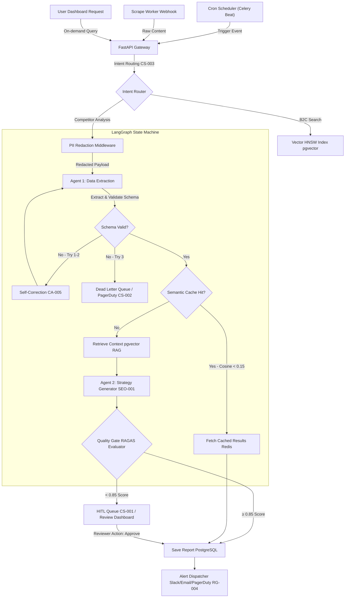

# Workflow Architecture — Nimblize Phase 5

**Project:** Nimblize — Phase 5  
**Document:** Workflows System Architecture  
**Status:** 🟢 Approved for Implementation  
**Last Updated:** 2026-07-19  

---

## 1. System Block Diagram

This block diagram represents the modular architecture of the automated Competitor Strategy Pipeline. It reuses existing Phase 4 resources and connects them to Phase 5 AI prompt and verification assets.



---

## 2. Component Architectures & Reuse Strategy

The Nimblize Automation Pipeline maximizes code efficiency by layering Phase 5 AI prompts directly onto existing backend layers:

### A. FastAPI Gateway & Intent Router (`CS-003`)
- **Action:** Intercepts incoming requests. Reuses the FastAPI controller infrastructure.
- **AI Integration:** Uses `CS-003` User Query Intent Classifier with `gpt-4o-mini` at `temperature: 0.0`.
- **Purpose:** Decouples user requests into deterministic routing target endpoints (B2C recommendation vs. B2B strategy).

### B. PII Redaction Middleware (Presidio)
- **Action:** Processes crawled text before sending payloads to public OpenAI APIs.
- **Component Reuse:** Leverages existing Microsoft Presidio Analyzer and Anonymizer.
- **Data Protection:** Replaces names, emails, and sensitive identifiers to comply with privacy policies.

### C. Agent 1 (Data Extraction Specialist)
- **Action:** Parses unstructured competitor texts into structured contracts.
- **Component Reuse:** Reuses the LangGraph agent nodes. Enforces the Pydantic data contract `IngestedCompetitorPayload`.
- **AI Integration:** Powered by `CA-001` (Extraction) and `CA-005` (Self-Correction retry loop).

### D. Redis Semantic Cache
- **Action:** Matches incoming queries against previous extractions to minimize LLM call costs.
- **Component Reuse:** Reuses the Redis caching connection with standard vector distance metrics.
- **Threshold:** Set to `< 0.15` cosine distance to ensure high-fidelity matches.

### E. RAG Context Retrieval
- **Action:** Performs vector search inside B2B/B2C catalogs to inject context.
- **Component Reuse:** Reuses the PostgreSQL `pgvector` HNSW index for sub-second similarity matching.

### F. Agent 2 (Strategy Generator)
- **Action:** Generates deep SEO analysis, SWOT structures, and keyword recommendations.
- **Component Reuse:** LangGraph Strategy Node.
- **AI Integration:** Maps to `SEO-001` (Core Strategy) along with `CA-002` (SWOT) and `SEO-005` (Content Gap).

### G. RAGAS Quality Gate
- **Action:** Evaluates the strategy output's faithfulness and relevancy relative to RAG retrieved context.
- **Component Reuse:** Existing LLM-as-a-judge runner.
- **Logic:** Enforces a rigid threshold of `≥ 0.85` composite score. Failures are written to the HITL PostgreSQL queue.

### H. Alert & Notification Engine
- **Action:** Dispatches execution logs, dashboard reports, or critical failure alerts.
- **AI Integration:** Maps to `RG-004` Notification Alert Composer.
- **Channels:** Generates channel-isolated formats for Slack hooks, PagerDuty incidents, and SendGrid HTML emails.

---

## 3. Data Contracts & State Management

The pipeline manages state through the LangGraph `PipelineState` typed dictionary:

```python
class PipelineState(TypedDict):
    pipeline_id: str
    competitor_url: str
    raw_content: str
    redacted_content: str
    extracted_payload: dict  # Matches IngestedCompetitorPayload
    rag_context: list
    strategy_report: dict    # Matches StrategyReport
    ragas_scores: dict
    status: str             # "EXTRACTION_RETRY", "HITL_REVIEW", "COMPLETED", "FAILED"
    attempt_count: int
    error_log: str
```

State transitions are transactional and saved in PostgreSQL to provide a complete audit trail for operations teams.
