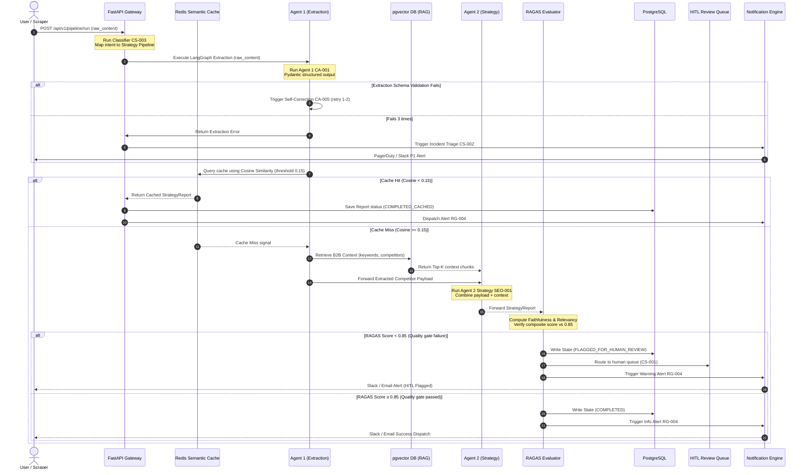

# Workflow Sequence Spec — Nimblize Phase 5

**Project:** Nimblize — Phase 5  
**Document:** Workflows Sequence Specification  
**Status:** 🟢 Approved for Implementation  
**Last Updated:** 2026-07-19  

---

## 1. Pipeline Execution Sequence

This sequence diagram traces the life-cycle of a single pipeline execution, mapping how data flows from the FastAPI gateway through agents, caches, and evaluation layers to final alerting channels.

---

## 2. Sequence Stage Walkthrough

### Stage 1: Trigger & Request Triage
1. A POST request containing raw competitor text is sent to the FastAPI endpoint `/api/v1/pipeline/run`.
2. The gateway intercepts the request and runs the `CS-003` (Intent Classifier) prompt template to classify the incoming query intent.
3. If classified as `COMPETITOR_ANALYSIS`, the gateway routes the query payload directly into the LangGraph orchestrator.

### Stage 2: PII Filtering & Extraction (Agent 1)
4. The text payload is anonymized using Microsoft Presidio (PII redaction).
5. The LangGraph state machine passes the anonymized text to the Extraction Node (Agent 1).
6. Agent 1 executes the `CA-001` prompt template to extract a structured JSON payload mapping to `IngestedCompetitorPayload`.
7. If parsing fails validation, a retry state is entered where the error message and the previous output are passed to the `CA-005` (Self-Correction) template.
8. If the extraction fails 3 consecutive attempts, the pipeline status is marked as `FAILED`, and the exception log is routed to the `CS-002` (Incident Triage Assistant) prompt to generate a PagerDuty alert.

### Stage 3: Semantic Cache Lookup
9. The successfully extracted competitor domain is queried against Redis Semantic Cache.
10. If a cached strategy report exists with a cosine similarity distance `< 0.15`, the cache retrieves the cached output, bypassing subsequent LLM strategy generation to save on token costs.
11. If no cached match is found, a cache miss is logged, and the execution flows to RAG retrieval.

### Stage 4: pgvector RAG Retrieval
12. The extracted keywords and domains from Agent 1 are vector-embedded.
13. A similarity query is run against the pgvector HNSW database table index.
14. The top vector chunks are fetched and loaded into the LangGraph pipeline state as reference context.

### Stage 5: Strategy Generation (Agent 2)
15. The Strategy Node (Agent 2) receives the extracted competitor JSON and the RAG context chunks.
16. Agent 2 executes the `SEO-001` prompt template to compile a strategic strategy report, identifying market gaps, SEO targets, and actionable dashboard recommendations.

### Stage 6: RAGAS Quality Gate Verification
17. The generated strategy report is fed to the RAGAS Evaluator.
18. The evaluator uses LLM-as-a-judge prompts to measure faithfulness, answer relevancy, and context recall.
19. A composite score is computed.
20. **If the score falls below the `0.85` threshold:**
    - The pipeline execution status is written to PostgreSQL as `FLAGGED_FOR_HUMAN_REVIEW`.
    - The payload is routed to the HITL manual queue.
    - A review summary is prepared using the `CS-001` (HITL Review Summarizer) prompt.
    - The Slack channel alert is prepared using `RG-004` and dispatched.
21. **If the score meets or exceeds the `0.85` threshold:**
    - The pipeline execution status is written to PostgreSQL as `COMPLETED`.
    - A success notification is prepared using `RG-004` and dispatched to Slack and email.
