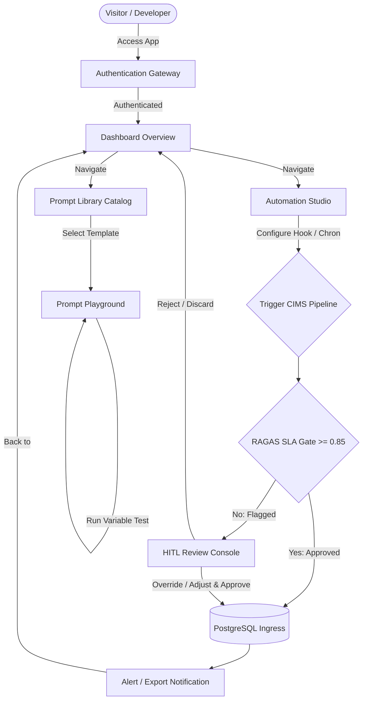

# Nimblize Studio — User Journey & Platform Workflows

**Project:** Nimblize Studio AI SaaS  
**Objective:** Complete navigational flowcharts mapping visitor interactions from onboarding to pipeline execution.  

---

## 1. End-to-End User Journey (Mermaid Flowchart)

---

## 2. Minute-by-Minute User Journey Specs

### 1. The Landing & Auth Phase
*   **Action:** Developer navigates to the app landing page, inputs credentials (JWT HS256 authenticated), and enters the **Dashboard Overview**.
*   **Time-to-complete:** Sub-5 seconds.

### 2. Prompt Auditing & Playground Tuning
*   **Action:** Developer notices a warning tag on an active prompt (`CA-001` or `SEO-001`). They click on the prompt card to open the **Prompt Playground**.
*   **Workspace Interaction:**
    - Modifies a placeholder variable instruction (e.g. adding a new negative constraint).
    - Runs a test execution using seed text parameters.
    - Compares temperature output metrics side-by-side.
    - Saves the template, triggering an automated Git commit in the background that bumps the version tags (e.g., `v1.1.0` ➔ `v1.1.1`).
*   **Time-to-complete:** 1–2 minutes.

### 3. Pipeline Ingestion & RAGAS Gate Inspection
*   **Action:** Developer triggers a manual CIMS pipeline run for a competitor URL in the **Automation Studio**.
*   **Workspace Interaction:**
    - The live timeline starts loading: `TRIGGER` ➔ `PII_FILTER` ➔ `CACHE` ➔ `RAG_RETRIEVAL` ➔ `EXTRACTION` ➔ `STRATEGY` ➔ `RAGAS_EVALUATION`.
    - RAGAS scores return a composite value of `0.79` (violating the `0.85` threshold).
    - The system pauses publication, flags the payload, and flashes a toast alert: *"Pipeline enqueued for HITL review."*
*   **Time-to-complete:** 15–30 seconds.

### 4. Human-In-The-Loop Action
*   **Action:** Evaluator clicks the toast alert or navigates to the **HITL Review Queue** screen.
*   **Workspace Interaction:**
    - Audits the redacted text comparison panel.
    - Reviews the generated SWOT points and product recommendations in the strategy editor.
    - Adjusts strategic copy parameters (e.g. correcting a recommendation).
    - Clicks **Approve and Persist**.
    - The profile commits to PostgreSQL pgvector and enqueues a Slack alert dispatch.
*   **Time-to-complete:** 30–60 seconds.
