# Nimblize Studio Frontend

A production-grade, dark-first visual interface built using Next.js 15, TypeScript, Tailwind CSS, shadcn/ui, base-ui primitives, and Framer Motion. 

This UI is designed to match the caliber of developer-focused AI SaaS products like Vercel and Linear, acting as a single console of truth for LLM Prompt Registry operations and pipeline validations.

---

## Getting Started

First, install dependencies and start the development server:

```bash
# Navigate to the frontend directory
cd frontend

# Install dependencies
npm install

# Run dev server
npm run dev
```

Open [http://localhost:3000](http://localhost:3000) in your browser to view the application console.
To view the high-fidelity landing page, visit [http://localhost:3000/landing](http://localhost:3000/landing).

---

## Project Structure & Architecture

```
frontend/
├── public/                 # Static assets (favicons, brand assets)
└── src/
    ├── app/                # Next.js App Router (pages and layouts)
    │   ├── automation/     # Screen 6: Automation Studio pipeline graph
    │   ├── evaluation/     # Screen 7: RAGAS Quality metrics dashboard
    │   ├── landing/        # Screen 1: High-Fidelity Landing Page
    │   ├── library/        # Screen 3 & 4: Prompt Library & Detail drawers
    │   ├── playground/     # Screen 5: Split-pane prompt playground & evaluation
    │   ├── reports/        # Screen 8: Reports Center markdown/PDF hub
    │   ├── settings/       # Screen 10: Settings preferences & credentials
    │   ├── workflow/       # Screen 9: Workflow Explorer trace canvas
    │   ├── globals.css     # Tailwind v4 globals, variables, and dark themes
    │   └── layout.tsx      # Core root layout with AppShell wrapper
    ├── components/         # Reusable presentation and interaction components
    │   ├── common/         # PageHeader, MetricCard, EmptyState, LoadingSkeletons
    │   ├── dashboard/      # CategoryChart, ExecutionTimeline, QuickActionsGrid, RecentActivity
    │   ├── layout/         # AppShell, AppSidebar, TopNavbar, MobileNav
    │   ├── library/        # CategoryOverview, PromptToolbar, PromptCard, PromptComparison
    │   └── ui/             # Core shadcn/ui design tokens and atomic primitives
    ├── lib/
    │   ├── mock-data.ts    # Consolidated client-side state and YAML contents
    │   └── navigation.ts   # Centralized sidebar route definitions
    └── providers/
        └── index.tsx       # next-themes and theme providers wrapping the app
```

---

## Component Hierarchy & Interaction Map

```mermaid
graph TD
    Root[RootLayout] --> AppShell[AppShell]
    AppShell --> AppSidebar[AppSidebar]
    AppShell --> TopNavbar[TopNavbar]
    AppShell --> Main[Main Content Router]

    %% Dashboard Route
    Main -->|Route: /| Dashboard[DashboardPage]
    Dashboard --> MetricCard[MetricCard Grid]
    Dashboard --> ExecutionTimeline[ExecutionTimeline]
    Dashboard --> CategoryChart[CategoryChart]
    Dashboard --> RecentActivity[RecentActivity]

    %% Library Route
    Main -->|Route: /library| Library[LibraryPage]
    Library --> CategoryOverview[CategoryOverview]
    Library --> PromptToolbar[PromptToolbar]
    Library --> PromptCardGrid[PromptCard Grid]
    Library --> PromptPreviewDrawer[PromptPreviewDrawer]
    Library --> PromptComparison[PromptComparison Dialog]

    %% Playground Route
    Main -->|Route: /playground| Playground[PlaygroundPage]
    Playground --> SplitPane[SplitPane Layout]
    Playground --> YAMLSource[YAML Source Viewer]
    Playground --> VariableEditor[VariableEditor Forms]
    Playground --> ResponsePanel[Response streaming panel]
    Playground --> RAGASEval[RAGAS Evaluation Scorecard]

    %% Automation Route
    Main -->|Route: /automation| Automation[AutomationStudioPage]
    Automation --> PipelineGraph[Pipeline Graph Nodes]
    Automation --> RuntimeLogs[Runtime Logs Terminal]

    %% Workflow Explorer
    Main -->|Route: /workflow| Workflow[WorkflowPage]
    Workflow --> TraceCanvas[Trace Canvas Nodes]
    Workflow --> ModuleDetail[Module Info Sidebar]

    %% Reports Route
    Main -->|Route: /reports| Reports[ReportsPage]
    Reports --> ReportGrid[Report Card Grid]
    Reports --> MarkdownDrawer[Markdown Viewer Drawer]

    %% Settings Route
    Main -->|Route: /settings| Settings[SettingsPage]
    Settings --> Appearance[Theme Switcher Card]
    Settings --> Keys[API Keys Form]
    Settings --> Shortcuts[Keyboard Shortcuts List]
```



---

## Design System Tokens (Figma Mapped)

- **Colors:** Deep Slate Dark Background (`#09090b`), Indigo Accent (`#6366f1` / `#4f46e5`).
- **Typography:** Inter for headings/body text, JetBrains Mono for YAML editors and log traces.
- **Spacing:** Strict 8px grid (gaps are defined via Tailwind standard `gap-4` for 16px, `gap-2` for 8px, etc.).
- **Motion:** snappy `ease-out-expo` curves with 150ms micro-interactions and 300ms layout drawer slides.
